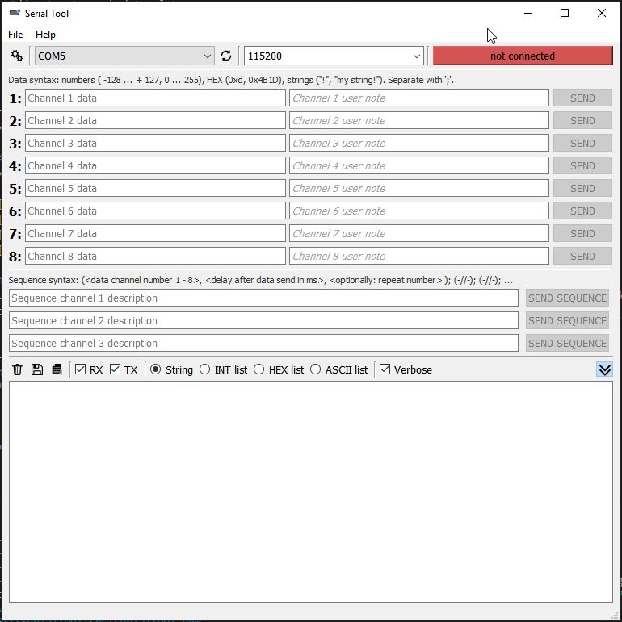
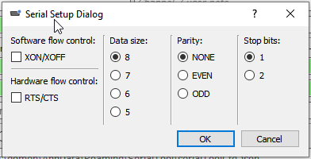

# Serial Tool
Serial Tool is a utility for developing, debugging and validating serial communication with PC. Great for data verification, custom protocols for embedded systems and other simple projects that include serial communication such as UART or RS232 (with appropriate hardware interface, like USB to UART converter).  

Original project [website](https://damogranlabs.com/2019/11/serial-tool-v2/): https://damogranlabs.com/2019/11/serial-tool-v2/

## Features
* Data types: integers, HEX numbers, characters, strings.
* Data/sequence field verification on the fly.
* User notes for each data channel.
* Sequence generator: multiple blocks of (data channel, delay, repeat number).
* Asynchronous read of all available received data.
* Different data output representation modes: strings, integers, HEX, ASCII.
* Log window display customization.
* Log window/raw data export capability.
* Save/load current settings to a configuration file.
  
## Windows build
See [releases page](https://github.com/damogranlabs/serial-tool/releases) for a windows executable (zip ~ 50MB)  

## VS Code workspace
For those who wish to take a look under the hood and/or contribute, VS Code workspace is available. Use tasks to speed up common actions like: build `.exe`, convert `.ui` to `.py`, run `.exe`, ...  

## Screenshots
New, default blank configuration:  
  
Example configuration with user notes:  
  
Example configuration and explanation of data/sequence field validator:  
  
Serial port settings, which are also a part of configuration file settings:  
  
Log/save/export window settings:  
  
Configurations can be stored and recalled:  
  

